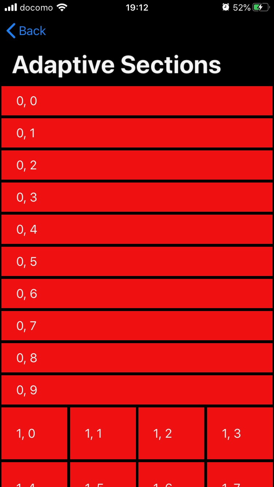
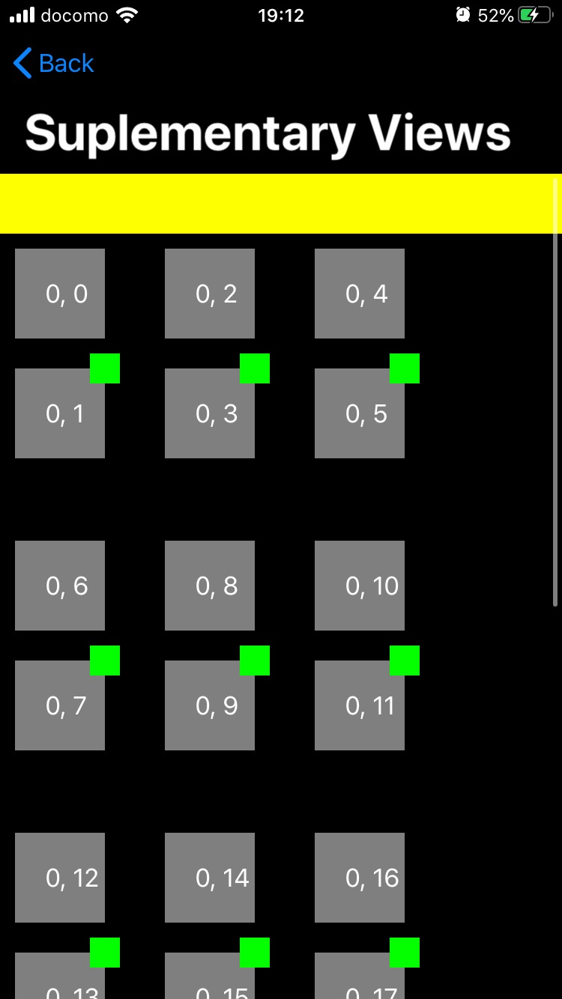
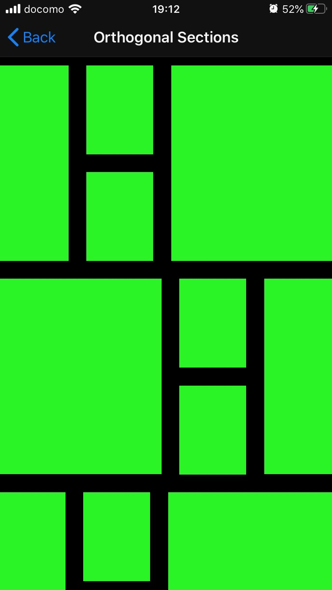

## DiffableDataSource and CompositionalLayout in practice.

Apple has just released some simple yet powerfull APIs for building complex UIs on modern app development. Let's see what they can do through some examples.

|
A nice example to express how efficient the new DiffableDataSource be./deselect
|
A collection view layout that can adapt changes in size of the collection.
|
Adding some additional views (badge, header, footer, etc...) to decorate the collection view.
|
Child scroll insde a collection view...
|
|---|---|---|---|
|| ||
